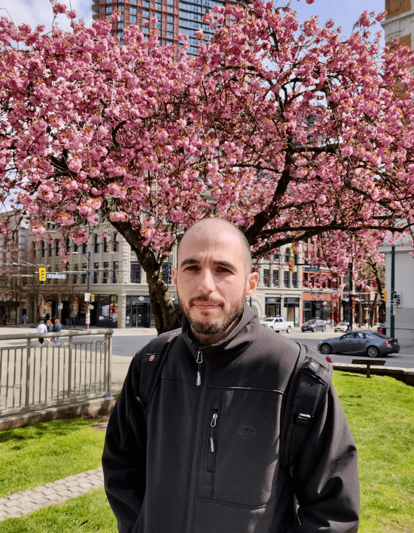

## Eliran Haziza

I'm a postdoctoral fellow at the Hebrew University of Jerusalem. In 2023, I completed my PhD in philosophy at the University of Toronto. I work mainly in the philosophy of language and epistemology, and my current research focuses on inquiry and questions.

You can reach me at <eliran.haziza@mail.utoronto.ca>.

### Publications

* [Norms of inquiry](https://philpapers.org/archive/HAZNOI.pdf). _Philosophy Compass_, forthcoming
* [Curious to know](https://philpapers.org/archive/HAZCTK.pdf). _Episteme_, forthcoming
* [Questioning and addressee knowledge](https://philpapers.org/archive/HAZQAA.pdf). _Synthese_, 2023
* [Reconciling the epistemic and the zetetic](https://philpapers.org/archive/HAZRTE.pdf). _Thought_, 2022
* [Assertion and the "how do you know" challenge](https://philpapers.org/archive/HAZAAT.pdf). _Synthese_, 2022
* [Assertion, implicature, and iterated knowledge](https://philpapers.org/archive/HAZAIA.pdf). _Ergo_, 2022


